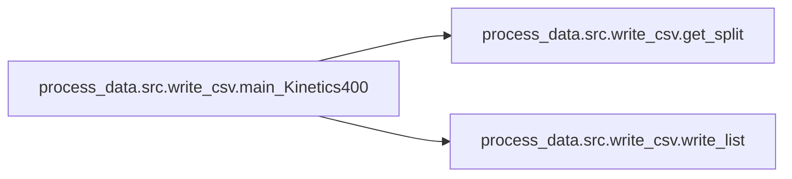

# Process Data Src

[_Documentation generated by Documatic_](https://www.documatic.com)

<!---Documatic-section-Codebase Structure-start--->
## Codebase Structure

<!---Documatic-block-system_architecture-start--->
```mermaid
None
```
<!---Documatic-block-system_architecture-end--->

# #
<!---Documatic-section-Codebase Structure-end--->

<!---Documatic-section-process_data.src.write_csv.write_list-start--->
## process_data.src.write_csv.write_list

<!---Documatic-section-write_list-start--->
<!---Documatic-block-process_data.src.write_csv.write_list-start--->
<details>
	<summary><code>process_data.src.write_csv.write_list</code> code snippet</summary>

```python
def write_list(data_list, path):
    with open(path, 'w') as f:
        writer = csv.writer(f, delimiter=',')
        for row in data_list:
            if row:
                writer.writerow(row)
    print('split saved to %s' % path)
```
</details>
<!---Documatic-block-process_data.src.write_csv.write_list-end--->
<!---Documatic-section-write_list-end--->

# #
<!---Documatic-section-process_data.src.write_csv.write_list-end--->

<!---Documatic-section-process_data.src.write_csv.main_UCF101-start--->
## process_data.src.write_csv.main_UCF101

<!---Documatic-section-main_UCF101-start--->


### Object Calls

* process_data.src.write_csv.write_list

<!---Documatic-block-process_data.src.write_csv.main_UCF101-start--->
<details>
	<summary><code>process_data.src.write_csv.main_UCF101</code> code snippet</summary>

```python
def main_UCF101(f_root, splits_root, csv_root='../data/ucf101/'):
    if not os.path.exists(csv_root):
        os.makedirs(csv_root)
    for which_split in [1, 2, 3]:
        train_set = []
        test_set = []
        train_split_file = os.path.join(splits_root, 'trainlist%02d.txt' % which_split)
        with open(train_split_file, 'r') as f:
            for line in f:
                vpath = os.path.join(f_root, line.split(' ')[0][0:-4]) + '/'
                train_set.append([vpath, len(glob.glob(os.path.join(vpath, '*.jpg')))])
        test_split_file = os.path.join(splits_root, 'testlist%02d.txt' % which_split)
        with open(test_split_file, 'r') as f:
            for line in f:
                vpath = os.path.join(f_root, line.rstrip()[0:-4]) + '/'
                test_set.append([vpath, len(glob.glob(os.path.join(vpath, '*.jpg')))])
        write_list(train_set, os.path.join(csv_root, 'train_split%02d.csv' % which_split))
        write_list(test_set, os.path.join(csv_root, 'test_split%02d.csv' % which_split))
```
</details>
<!---Documatic-block-process_data.src.write_csv.main_UCF101-end--->
<!---Documatic-section-main_UCF101-end--->

# #
<!---Documatic-section-process_data.src.write_csv.main_UCF101-end--->

<!---Documatic-section-process_data.src.write_csv.main_HMDB51-start--->
## process_data.src.write_csv.main_HMDB51

<!---Documatic-section-main_HMDB51-start--->


### Object Calls

* process_data.src.write_csv.write_list

<!---Documatic-block-process_data.src.write_csv.main_HMDB51-start--->
<details>
	<summary><code>process_data.src.write_csv.main_HMDB51</code> code snippet</summary>

```python
def main_HMDB51(f_root, splits_root, csv_root='../data/hmdb51/'):
    if not os.path.exists(csv_root):
        os.makedirs(csv_root)
    for which_split in [1, 2, 3]:
        train_set = []
        test_set = []
        split_files = sorted(glob.glob(os.path.join(splits_root, '*_test_split%d.txt' % which_split)))
        assert len(split_files) == 51
        for split_file in split_files:
            action_name = os.path.basename(split_file)[0:-16]
            with open(split_file, 'r') as f:
                for line in f:
                    video_name = line.split(' ')[0]
                    _type = line.split(' ')[1]
                    vpath = os.path.join(f_root, action_name, video_name[0:-4]) + '/'
                    if _type == '1':
                        train_set.append([vpath, len(glob.glob(os.path.join(vpath, '*.jpg')))])
                    elif _type == '2':
                        test_set.append([vpath, len(glob.glob(os.path.join(vpath, '*.jpg')))])
        write_list(train_set, os.path.join(csv_root, 'train_split%02d.csv' % which_split))
        write_list(test_set, os.path.join(csv_root, 'test_split%02d.csv' % which_split))
```
</details>
<!---Documatic-block-process_data.src.write_csv.main_HMDB51-end--->
<!---Documatic-section-main_HMDB51-end--->

# #
<!---Documatic-section-process_data.src.write_csv.main_HMDB51-end--->

<!---Documatic-section-process_data.src.write_csv.get_split-start--->
## process_data.src.write_csv.get_split

<!---Documatic-section-get_split-start--->
<!---Documatic-block-process_data.src.write_csv.get_split-start--->
<details>
	<summary><code>process_data.src.write_csv.get_split</code> code snippet</summary>

```python
def get_split(root, split_path, mode):
    print('processing %s split ...' % mode)
    print('checking %s' % root)
    split_list = []
    split_content = pd.read_csv(split_path).iloc[:, 0:4]
    split_list = Parallel(n_jobs=64)((delayed(check_exists)(row, root) for (i, row) in tqdm(split_content.iterrows(), total=len(split_content))))
    return split_list
```
</details>
<!---Documatic-block-process_data.src.write_csv.get_split-end--->
<!---Documatic-section-get_split-end--->

# #
<!---Documatic-section-process_data.src.write_csv.get_split-end--->

<!---Documatic-section-process_data.src.write_csv.check_exists-start--->
## process_data.src.write_csv.check_exists

<!---Documatic-section-check_exists-start--->
<!---Documatic-block-process_data.src.write_csv.check_exists-start--->
<details>
	<summary><code>process_data.src.write_csv.check_exists</code> code snippet</summary>

```python
def check_exists(row, root):
    dirname = '_'.join([row['youtube_id'], '%06d' % row['time_start'], '%06d' % row['time_end']])
    full_dirname = os.path.join(root, row['label'], dirname)
    if os.path.exists(full_dirname):
        n_frames = len(glob.glob(os.path.join(full_dirname, '*.jpg')))
        return [full_dirname, n_frames]
    else:
        return None
```
</details>
<!---Documatic-block-process_data.src.write_csv.check_exists-end--->
<!---Documatic-section-check_exists-end--->

# #
<!---Documatic-section-process_data.src.write_csv.check_exists-end--->

<!---Documatic-section-process_data.src.write_csv.main_Kinetics400-start--->
## process_data.src.write_csv.main_Kinetics400

<!---Documatic-section-main_Kinetics400-start--->


### Object Calls

* process_data.src.write_csv.get_split
* process_data.src.write_csv.write_list

<!---Documatic-block-process_data.src.write_csv.main_Kinetics400-start--->
<details>
	<summary><code>process_data.src.write_csv.main_Kinetics400</code> code snippet</summary>

```python
def main_Kinetics400(mode, k400_path, f_root, csv_root='../data/kinetics400'):
    train_split_path = os.path.join(k400_path, 'kinetics_train/kinetics_train.csv')
    val_split_path = os.path.join(k400_path, 'kinetics_val/kinetics_val.csv')
    test_split_path = os.path.join(k400_path, 'kinetics_test/kinetics_test.csv')
    if not os.path.exists(csv_root):
        os.makedirs(csv_root)
    if mode == 'train':
        train_split = get_split(os.path.join(f_root, 'train_split'), train_split_path, 'train')
        write_list(train_split, os.path.join(csv_root, 'train_split.csv'))
    elif mode == 'val':
        val_split = get_split(os.path.join(f_root, 'val_split'), val_split_path, 'val')
        write_list(val_split, os.path.join(csv_root, 'val_split.csv'))
    elif mode == 'test':
        test_split = get_split(f_root, test_split_path, 'test')
        write_list(test_split, os.path.join(csv_root, 'test_split.csv'))
    else:
        raise IOError('wrong mode')
```
</details>
<!---Documatic-block-process_data.src.write_csv.main_Kinetics400-end--->
<!---Documatic-section-main_Kinetics400-end--->

# #
<!---Documatic-section-process_data.src.write_csv.main_Kinetics400-end--->

<!---Documatic-section-process_data.src.extract_frame.extract_video_opencv-start--->
## process_data.src.extract_frame.extract_video_opencv

<!---Documatic-section-extract_video_opencv-start--->


### Object Calls

* process_data.src.extract_frame.resize_dim

<!---Documatic-block-process_data.src.extract_frame.extract_video_opencv-start--->
<details>
	<summary><code>process_data.src.extract_frame.extract_video_opencv</code> code snippet</summary>

```python
def extract_video_opencv(v_path, f_root, dim=240):
    v_class = v_path.split('/')[-2]
    v_name = os.path.basename(v_path)[0:-4]
    out_dir = os.path.join(f_root, v_class, v_name)
    if not os.path.exists(out_dir):
        os.makedirs(out_dir)
    vidcap = cv2.VideoCapture(v_path)
    nb_frames = int(vidcap.get(cv2.CAP_PROP_FRAME_COUNT))
    width = vidcap.get(cv2.CAP_PROP_FRAME_WIDTH)
    height = vidcap.get(cv2.CAP_PROP_FRAME_HEIGHT)
    if width == 0 or height == 0:
        print(v_path, 'not successfully loaded, drop ..')
        return
    new_dim = resize_dim(width, height, dim)
    (success, image) = vidcap.read()
    count = 1
    while success:
        image = cv2.resize(image, new_dim, interpolation=cv2.INTER_LINEAR)
        cv2.imwrite(os.path.join(out_dir, 'image_%05d.jpg' % count), image, [cv2.IMWRITE_JPEG_QUALITY, 80])
        (success, image) = vidcap.read()
        count += 1
    if nb_frames > count:
        print('/'.join(out_dir.split('/')[-2:]), 'NOT extracted successfully: %df/%df' % (count, nb_frames))
    vidcap.release()
```
</details>
<!---Documatic-block-process_data.src.extract_frame.extract_video_opencv-end--->
<!---Documatic-section-extract_video_opencv-end--->

# #
<!---Documatic-section-process_data.src.extract_frame.extract_video_opencv-end--->

<!---Documatic-section-process_data.src.extract_frame.resize_dim-start--->
## process_data.src.extract_frame.resize_dim

<!---Documatic-section-resize_dim-start--->
<!---Documatic-block-process_data.src.extract_frame.resize_dim-start--->
<details>
	<summary><code>process_data.src.extract_frame.resize_dim</code> code snippet</summary>

```python
def resize_dim(w, h, target):
    if w >= h:
        return (int(target * w / h), int(target))
    else:
        return (int(target), int(target * h / w))
```
</details>
<!---Documatic-block-process_data.src.extract_frame.resize_dim-end--->
<!---Documatic-section-resize_dim-end--->

# #
<!---Documatic-section-process_data.src.extract_frame.resize_dim-end--->

<!---Documatic-section-process_data.src.extract_frame.main_UCF101-start--->
## process_data.src.extract_frame.main_UCF101

<!---Documatic-section-main_UCF101-start--->
<!---Documatic-block-process_data.src.extract_frame.main_UCF101-start--->
<details>
	<summary><code>process_data.src.extract_frame.main_UCF101</code> code snippet</summary>

```python
def main_UCF101(v_root, f_root):
    print('extracting UCF101 ... ')
    print('extracting videos from %s' % v_root)
    print('frame save to %s' % f_root)
    if not os.path.exists(f_root):
        os.makedirs(f_root)
    v_act_root = glob.glob(os.path.join(v_root, '*/'))
    for (i, j) in tqdm(enumerate(v_act_root), total=len(v_act_root)):
        v_paths = glob.glob(os.path.join(j, '*.avi'))
        v_paths = sorted(v_paths)
        Parallel(n_jobs=32)((delayed(extract_video_opencv)(p, f_root) for p in tqdm(v_paths, total=len(v_paths))))
```
</details>
<!---Documatic-block-process_data.src.extract_frame.main_UCF101-end--->
<!---Documatic-section-main_UCF101-end--->

# #
<!---Documatic-section-process_data.src.extract_frame.main_UCF101-end--->

<!---Documatic-section-process_data.src.extract_frame.main_HMDB51-start--->
## process_data.src.extract_frame.main_HMDB51

<!---Documatic-section-main_HMDB51-start--->
<!---Documatic-block-process_data.src.extract_frame.main_HMDB51-start--->
<details>
	<summary><code>process_data.src.extract_frame.main_HMDB51</code> code snippet</summary>

```python
def main_HMDB51(v_root, f_root):
    print('extracting HMDB51 ... ')
    print('extracting videos from %s' % v_root)
    print('frame save to %s' % f_root)
    if not os.path.exists(f_root):
        os.makedirs(f_root)
    v_act_root = glob.glob(os.path.join(v_root, '*/'))
    for (i, j) in tqdm(enumerate(v_act_root), total=len(v_act_root)):
        v_paths = glob.glob(os.path.join(j, '*.avi'))
        v_paths = sorted(v_paths)
        Parallel(n_jobs=32)((delayed(extract_video_opencv)(p, f_root) for p in tqdm(v_paths, total=len(v_paths))))
```
</details>
<!---Documatic-block-process_data.src.extract_frame.main_HMDB51-end--->
<!---Documatic-section-main_HMDB51-end--->

# #
<!---Documatic-section-process_data.src.extract_frame.main_HMDB51-end--->

<!---Documatic-section-process_data.src.extract_frame.main_kinetics400-start--->
## process_data.src.extract_frame.main_kinetics400

<!---Documatic-section-main_kinetics400-start--->
<!---Documatic-block-process_data.src.extract_frame.main_kinetics400-start--->
<details>
	<summary><code>process_data.src.extract_frame.main_kinetics400</code> code snippet</summary>

```python
def main_kinetics400(v_root, f_root, dim=150):
    print('extracting Kinetics400 ... ')
    for basename in ['train_split', 'val_split']:
        v_root_real = v_root + '/' + basename
        if not os.path.exists(v_root_real):
            print('Wrong v_root')
            sys.exit()
        f_root_real = '/scratch/local/ssd/htd/kinetics400/frame_full' + '/' + basename
        print('Extract to: \nframe: %s' % f_root_real)
        if not os.path.exists(f_root_real):
            os.makedirs(f_root_real)
        v_act_root = glob.glob(os.path.join(v_root_real, '*/'))
        v_act_root = sorted(v_act_root)
        for (i, j) in tqdm(enumerate(v_act_root), total=len(v_act_root)):
            v_paths = glob.glob(os.path.join(j, '*.mp4'))
            v_paths = sorted(v_paths)
            v_class = j.split('/')[-2]
            out_dir = os.path.join(f_root_real, v_class)
            if os.path.exists(out_dir):
                print(out_dir, 'exists!')
                continue
            print('extracting: %s' % v_class)
            Parallel(n_jobs=32)((delayed(extract_video_opencv)(p, f_root_real, dim=dim) for p in tqdm(v_paths, total=len(v_paths))))
```
</details>
<!---Documatic-block-process_data.src.extract_frame.main_kinetics400-end--->
<!---Documatic-section-main_kinetics400-end--->

# #
<!---Documatic-section-process_data.src.extract_frame.main_kinetics400-end--->

[_Documentation generated by Documatic_](https://www.documatic.com)